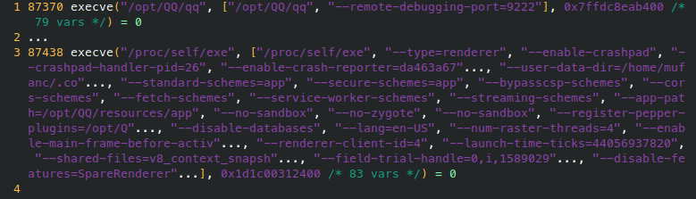

+++
title = '将 QQ for Linux 沙盒化'
summary = '使用 bwrap 为其提供基本的存储访问隔离，同时集成一些其它小功能'
date = 2023-01-01T17:12:00+08:00
slug = '8b32de5f'
tags = [ 'bwrap', 'QQ' ]
categories = []
+++

最近腾讯推出了基于 Electron 的 [Linux QQ](https://im.qq.com/linuxqq/index.shtml) 3.0 版本，总算是可以正常收发消息了，但鉴于之前 QQ 在 Windows 平台上的 [种种流氓行为](https://www.zhihu.com/question/264625793)，自然是不可能放心地让它在我的机器上裸奔的

但好在这里是 Linux，我们可以玩许多魔法，不是么。

## bwrap 沙盒

[bubblewrap](https://github.com/containers/bubblewrap) 是一个基于用户命名空间的非特权沙盒，本质上就是 `CLONE_NEWUSER` 的同时分离一些其它的命名空间，然后就可以在其中做一些非特权挂载，外加一些权限的处理。参考依云的 [这篇博客](https://blog.lilydjwg.me/2021/8/12/using-bwrap.215869.html)，里面介绍了 bwrap 的一些简单用法

因为现阶段暂未发现 QQ 有什么越权的流氓行为，我只限制了 QQ 在家目录下乱写文件，没有对访问设备文件做太多约束：

```bash
bwrap --unshare-all --share-net \
  --dev-bind / / \
  --proc /proc \
  --tmpfs $HOME \
  --bind $HOME/.config/QQ $HOME/.config/QQ \
  --chdir ~ \
  /opt/QQ/qq
```

## 打包脚本

使用 Ubuntu 自带的 `dpkg` 工具就能很方便地对 deb 文件进行解包和打包，配合一些 shell 命令，就能制作出一个简易的自动打包工具，脚本已经上传到 GitHub：

<div class="w-[80%] mx-auto">



</div>

## 处理链接

某日打开链接的时候：


常年使用第三方 QQ 的我，甚至已经快忘了还存在这种页面，不由得想起早年在 Windows 上用 TIM 的时候可是被这玩意恶心坏了，最后弄了个 Chrome 扩展来自动重定向这些链接才总算是解决问题

但好在这里是 Linux，我们可以玩许多魔法，不是么。

其实我们并不需要写 Chrome 扩展或是把 Chrome 怎么样，既然是 QQ 的问题，那就从 QQ 上来解决


* 附一个完整的 strace 命令

```bash
strace -e trace=execve -f -s 1024 -v -o syscall.txt qq
# 参数说明:
# -e trace=execve : 过滤 execve
# -f : 追踪 fork
# -s 1024 : 字符串最大长度
# -v : 打印完整参数列表
# -o strace.txt : 输出文件
```

strace 一下它的 `execve` 系统调用，可以看到它会试图在 `PATH` 中搜索 `xdg-open`，那么只需要在 bwrap 启动前给它的 `PATH` 塞上一些东西，由我们来代理这个 `xdg-open` 就好了

```python
#!/usr/bin/env python3
import os
import sys
from sys import argv
from urllib import parse


def my_exec(*args):
    env = set(os.environ['PATH'].split(':'))
    env.remove('/opt/QQ/__patch__')
    os.environ['PATH'] = ':'.join(env)
    os.execvp('xdg-open', ['xdg-open', *args])
    exit(1)


if len(argv) == 1:
    my_exec(*argv[1:])

result = parse.urlsplit(argv[1])

if result.netloc == 'c.pc.qq.com':
    my_exec(parse.parse_qs(result.query)['pfurl'][0])

my_exec(*argv[1:])
```

似乎是 bwrap 隔离的原因，在 QQ 中启动 Chrome 会出现在独立的窗口中，而不是在已打开的 Chrome 新增一个标签页，暂时没想到什么合适的解决办法（或许可以用管道弄个事件总线把消息传出来？）

## 意外发现

使用下面的命令跟踪 Linux QQ：

```bash
strace -e trace=openat /opt/QQ/qq |& grep /opt/QQ
```

可以发现它打开了 `/opt/QQ/resources/app` 底下的一些 js 文件，这里我们选择 `background.js`，向这个文件开头添加一些内容：

```javascript
(() => {    
    const { app, BrowserWindow } = require('electron')    
    try {    
        app.on('ready', () => {    
            setTimeout(() => {    
                console.log(BrowserWindow.getAllWindows())    
            }, 1000)    
        })    
    } catch(err) {    
        console.error(err)    
    }    
})();   
```

然后启动 QQ，我们写入的 js 代码已经被正确加载并执行了：


我们现在拥有了对其注入代码的能力，然而没法调试可不行！首先尝试像其它 eletron 应用那样为它添加 `--remote-debugging-port=9222` 参数，然而并没有起到什么作用

于是 strace 分析，对比同为 electron 的 Icalingua++，可以发现 Icalingua 在启动 renderer 进程时把我们的参数顺带传递了过去，而 Linux QQ 并没有：

* Icalingua++


* Linux QQ



于是用 C++ 搓了个库来 Hook 它的 `execvp` 调用：

```c++
#include <cstdio>
#include <cstdlib>
#include <dlfcn.h>
#include <memory.h>

extern "C"
int execvp(const char *path, char *argv[]) {
    typedef decltype(&execvp) Self;

    static void *handle = nullptr;
    static Self backup_old = nullptr;

    if (!handle) {
        handle = dlopen("libc.so.6", RTLD_LAZY);
        backup_old = (Self) dlsym(handle, "execvp");
    }

    int argc = 0;
    for (char **ptr = argv; *ptr; ptr++) {
        argc++;
    }

    char **argv_new = (char **) malloc(sizeof(char *) * (argc + 2));
    memcpy(argv_new, argv, sizeof(char *) * argc);
    argv_new[argc] = "--remote-debugging-port=9222";
    argv_new[argc + 1] = nullptr;

    printf("execvp: %s\n", path);
    printf("argv:\n");
    for (char **ptr = argv_new; *ptr; ptr++) {
        printf("    %s\n", *ptr);
    }

    int result = backup_old(path, argv_new);
    
    free(argv_new);
    return result;
}

[[maybe_unused]]
[[gnu::constructor]] void on_inject() {
    printf("Hack: injected!\n");
}
```

设置 `LD_PRELOAD` 让我们的代码注入进去，给每一个 `execvp` 出来的进程都加上 `--remote-debugging-port=9222` 参数：


可以看到我们的代码确实注入进去了，然而转到 Chrome 查看，还是没办法访问到调试器

**-- 未完待续 --**
