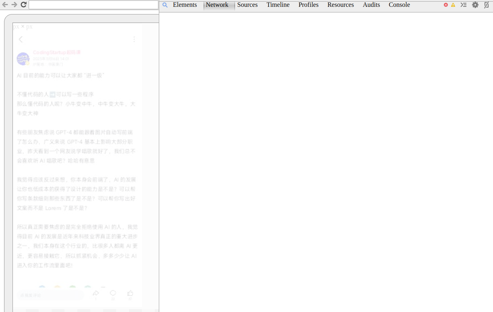
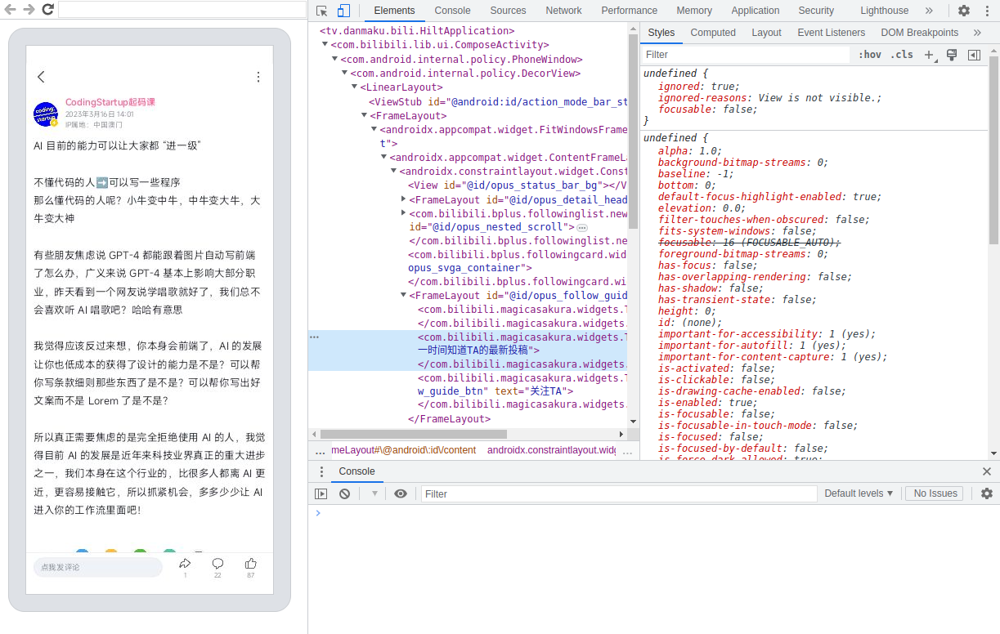
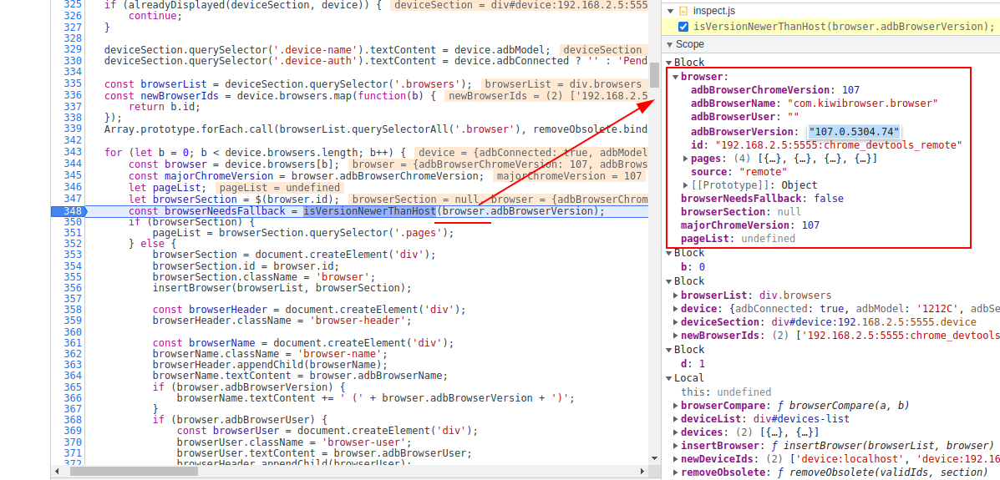
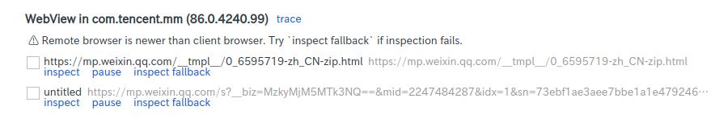
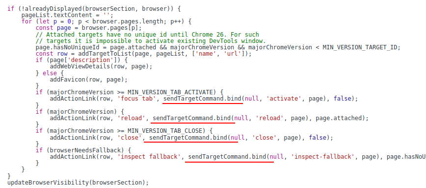

+++
title = 'Chrome Inspect'
summary = '使用扩展优化 Chrome 远程调试的使用体验，更优雅地调试移动端网页'
date = 2023-03-17T16:47:27+08:00
slug = 'bb53f4ee'
tags = []
categories = []
draft = false
+++

我们在调试移动端的网页、或是使用 [Stetho](https://github.com/facebook/stetho) 等工具时，经常需要操作 `chrome://inspect`，然而这玩意在远程 Chrome 版本低于本地 Chrome 时会走 Google 的服务器（不清楚为何要这样设计），导致异常卡顿，几乎无法使用：



而当 Chrome 认为自己的版本低于远程 Chrome 版本时，会增加一个 inspect fallback 的选项，通过 inspect fallback 进入的调试界面就正常很多：



所以我们会有一个很自然的想法：能否让所有远程调试都走 inspect fallback？好在 `chrome://inspect` 这个页面本身也是可以调试的，所以能够很轻易地找出它的逻辑：

```javascript
const browserNeedsFallback = isVersionNewerThanHost(browser.adbBrowserVersion);

function isVersionNewerThanHost(version) {
    if (!HOST_CHROME_VERSION) {
        return false;
    }
    version = version.split('.').map(s => Number(s) || 0);
    for (let i = 0; i < HOST_CHROME_VERSION.length; i++) {
        if (i > version.length) {
            return false;
        }
        if (HOST_CHROME_VERSION[i] > version[i]) {
            return false;
        }
        if (HOST_CHROME_VERSION[i] < version[i]) {
            return true;
        }
    }
    return false;
}
```

这里的 `HOST_CHROME_VERSION` 是从 User-Agent 里拆出来的一个四元组：

```javascript
const chromeMatch = navigator.userAgent.match(/(?:^|\W)Chrome\/(\S+)/);
if (chromeMatch && chromeMatch.length > 1) {
    HOST_CHROME_VERSION = chromeMatch[1].split('.').map(s => Number(s) || 0);
}
```

打个断点再看看参数传进去的 `version` 又是什么东西：



也是四个数字，中间用点隔开的版本号，这样一来就有了一个很简单的解决办法：修改 UA 中的 Chrome 版本号为 `0.0.0.0`：

```javascript
(() => {
    const backup = Object.getOwnPropertyDescriptor(Navigator.prototype, 'userAgent').get
    Object.defineProperty(
        Navigator.prototype, 'userAgent', {
            get() {
                return backup.apply(this).replace(/(?<=(?:^|\W)Chrome\/)\S+/, '0.0.0.0')
            }
        }
    )
})()
```

（注意上方代码**不是油猴脚本**，具体用法会在最后的 Gist 中给出）



嗯，现在确实能够用 inspect fallback 调试了，但是看着…… 实在有点丑，无用的 inspect 按钮没去掉不说，上面还多了一条警告信息，而且把 UA 里的版本号强行设为 0 也可能会引入一些奇怪的问题

那么有没有办法把 inspect 按钮的行为直接替换成 inspect fallback 呢？既然能够注入脚本，办法显然是有的，再不济可以也套个 `MutationObserver`，只要 DOM 一发生变化，就立马用脚本把它维护成新的样式……

但再仔细看看它的代码就能发现，其实完全不需要对 DOM 动手脚，它的这些按钮都是通过一个 `addActionLink` 函数来绑定的：



那么我们便可以来一手「偷天换日」，一旦发现参数为 `inspect`，就替换为 inspect fallback 的逻辑：

```javascript
(function () {
    Function.prototype.bind = new Proxy(
        Function.prototype.bind, {
            apply(func, thisObj, args) {
                if (thisObj.name == 'sendTargetCommand' && args[1] == 'inspect') {
                    args[1] = 'inspect-fallback'
                }
                return Reflect.apply(func, thisObj, args)
            }
        }
    )
})()
```

注入代码的能力则由 Chrome 扩展程序提供，具体实现可以参考 [这篇 Gist](https://gist.github.com/Mufanc/368f5c64924bfee67a35ac4494c79c34)
