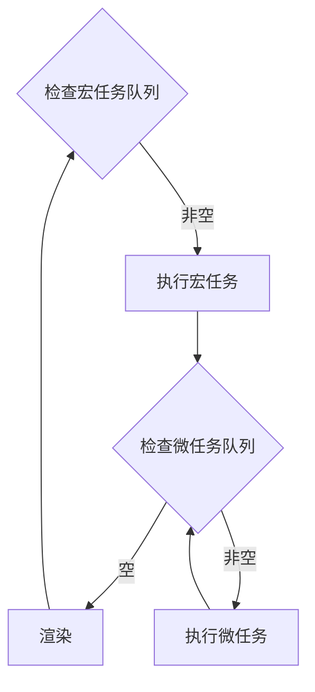

+++
title = '宏任务、微任务和事件循环'
summary = '理解 JavaScript 事件循环和异步任务机制'
date = 2023-03-29T21:45:13+08:00
slug = 'aca8839d'
tags = []
categories = []
draft = false
mermaid = true
+++

我们知道，JavaScript 是一个单线程的脚本语言，但却有诸如 `setTimeout`、`setIntetval` 等看似多线程的操作

为什么说是「看似」，因为 JavaScript 内部实际是由事件循环来管理异步操作的，假如我们执行了阻塞操作，后面的代码就不会被执行：

```javascript
setTimeout(() => {
    console.log('Never reaches here!')
}, 1000)

while (1);
```

## 事件循环

回顾一下 JavaScript 的运行过程：

* 从前往后，一行一行顺序执行（同步执行，可能产生异步任务）

* 如果某一行报错，则停止下面代码的执行，向上寻找 catch

* 同步代码执行完后，再执行异步代码

引擎首先会检查宏任务队列，取出一个宏任务并执行，然后依次执行所有微任务，直到微任务队列为空，开始下一轮循环。用流程图简单描述，就是下面这样：



当宏任务和微任务队列都被执行完，解释引擎会陷入等待（仅限浏览器），当有新的任务被添加时恢复执行；也就是说，一次 Eventloop 循环会处理一个宏任务和所有这次循环中产生的微任务

## 宏任务 & 微任务

#### 常见的宏任务有：

* 新程序被执行，如 `<script>` 元素里的代码运行

* `addEventListener` 的回调函数

* 定时器系列，如 `setTimeout` 和 `setInterval`

##  ## 常见的微任务有：

* Promise 的回调：`.then()`、`.catch()`、`.finally()`

* MutationObserver

## 总结

最后推荐一个可视化事件循环的网站：[jsv9000](https://www.jsv9000.app/)，在这里可以直观查看 JavaScript 调用栈和任务队列的运作过程，有助于更深入地理解和运用

