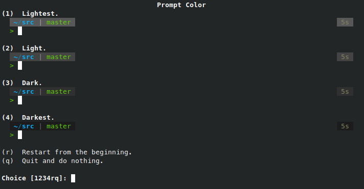
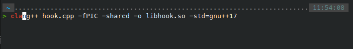
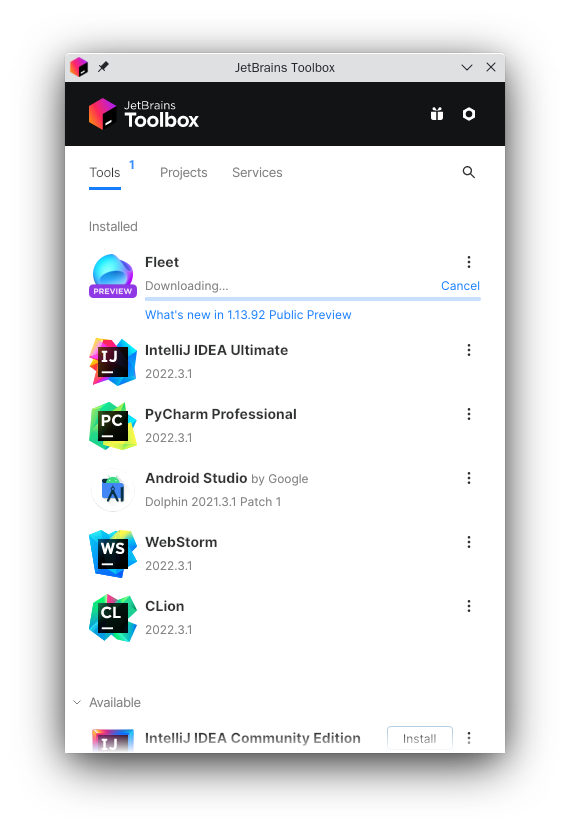
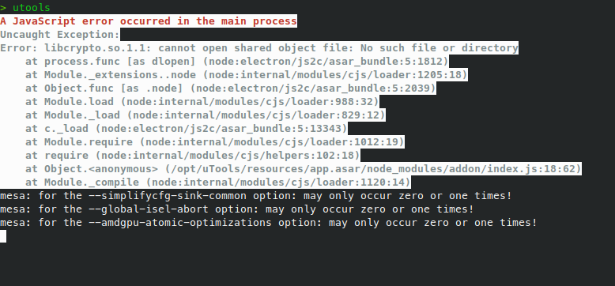
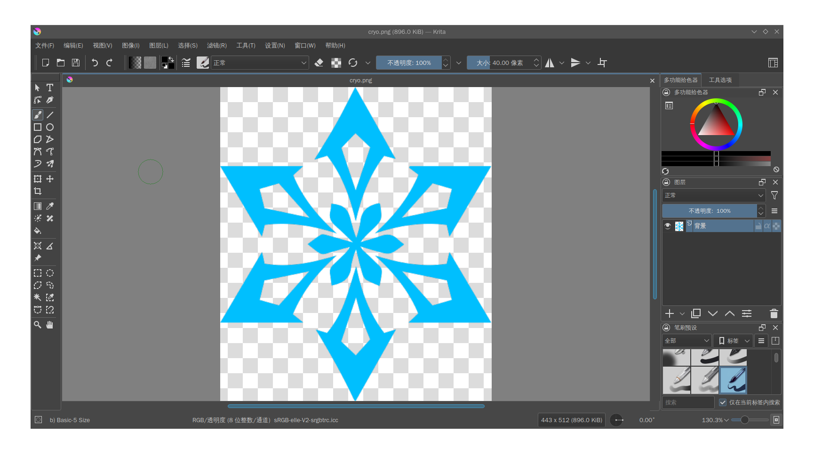
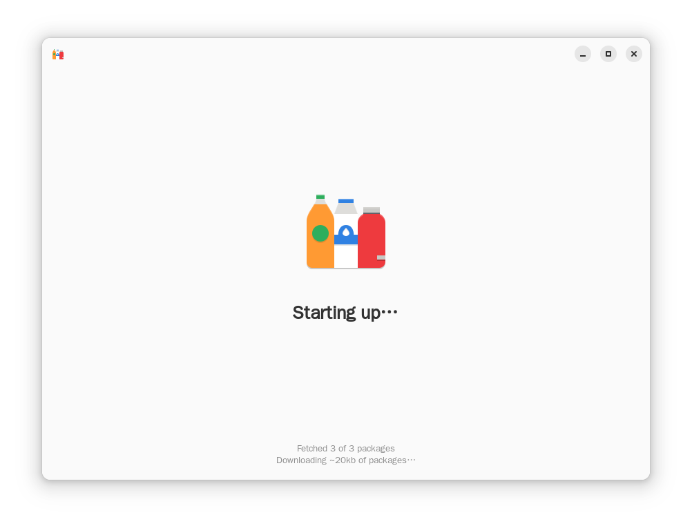
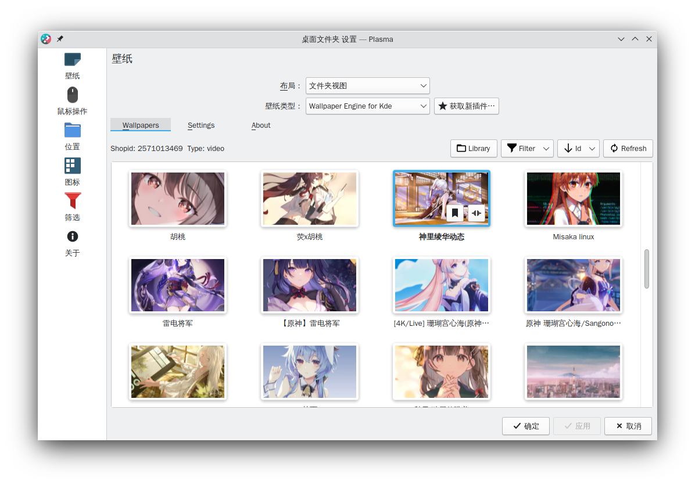

+++
title = '配置一个舒适的 KDE 环境'
summary = '记录各类常用软件的 安装＆配置 过程，方便下次装系统时快速上手'
date = 2022-12-27T01:05:19+08:00
slug = '96605854'
draft = false
showtoc = true
+++

## 基础设施

### 终端（zsh）

想让 Linux 系统好用，没有一个好的终端肯定是不行的，自带的 bash 一遇到彩色 prompt 就抽风，补全功能也不够强大，相比之下我更喜欢将 zsh 作为默认的 shell 来使用

* 安装并切换到 zsh

```bash
sudo apt install zsh
chsh -s zsh
```

注销并重新登录，就能看到 zsh 已经作为默认终端出现了

#### 插件 & 主题

个人并不是很喜欢 oh-my-zsh，原因是这玩意的启动速度太慢了，所以接下来这些插件、主题都会采用手动配置的方式。首先创建一个文件夹作为容器：

```bash
mkdir ~/.zsh
```

下载插件的时候，全部 `git clone` 到此文件夹即可

* 主题（p10k）



比起 oh-my-zsh 里面那一堆自带的主题，[p10k](https://github.com/romkatv/powerlevel10k) 简直是通杀全场，高度可定制性和傻瓜式的 configuration wizard 能够很好地帮助你选择一个适合自己的风格

它同时还集成了 git、系统监视器、统计命令运行时长等许多小功能……

```bash
git clone --depth=1 https://gitee.com/romkatv/powerlevel10k.git ~/.zsh/powerlevel10k
echo 'source ~/.zsh/powerlevel10k/powerlevel10k.zsh-theme' >>~/.zshrc
```

* 自动补全

[zsh-autosuggestions](https://github.com/zsh-users/zsh-autosuggestions) 可以根据历史命令显示自动完成提示，实打实的终端效率神器，用过就再也回不去了



* 语法高亮

[zsh-syntax-highlighting](https://github.com/zsh-users/zsh-syntax-highlighting) 可以让输入的命令呈现语法高亮显示，对理清较长 shell 命令的层次结构很有帮助


#### Aliases

合理配置一些 alias 能够极大地提升终端使用效率，下面贴出我的部分配置：

```bash
alias zshrc="vim ~/.zshrc && source ~/.zshrc"  # 快速编辑 zsh 配置

alias grep="grep --color"  # 使 grep 高亮标记结果

# 使用 Rust 编写的高性能文件查找工具（强烈推荐！）
# 仓库地址：https://github.com/sharkdp/fd
alias find="fdfind"  

# 在当前目录打开 dolphin
alias ::="LANGUAGE=zh_CN:en_US dolphin . >/dev/null 2>&1 &"

# 快捷复制
alias copy='tee $(tty) | xclip -selection clipboard -r'

alias ls="ls --color=tty"  # 使 ls 根据文件属性显示不同的颜色
alias ll="ls -l"
alias la="ls -a"

alias rm="rm -I"  # 防止误操作
alias cp="cp -i"
alias mv="mv -i"
```

### Clash For Windows（闭源）

* [下载链接](https://github.com/Fndroid/clash_for_windows_pkg/releases/latest)

科学上网工具，虽然名字带个「Windows」，但实际上是全平台的，Linux 下载解压后运行文件夹内的 `cfw` 即可。

#### DNS Hijack

按照熟悉的流程配置好 [TUN Mode](https://docs.cfw.lbyczf.com/contents/tun.html)，却发现终端内 `git clone` 速度依然极慢，直接 `curl google.com` 也会被重置连接，只有 Chrome 走的 [SwitchyOmega](https://chrome.google.com/webstore/detail/proxy-switchyomega/padekgcemlokbadohgkifijomclgjgif?hl=zh-CN) Socks5 能正常代理

查看日志，发现连接虽然能够被 TUN 捕获，规则却走的直连，推测可能是 DNS Hijack 出了问题，在终端中测试：

```bash
nslookup google.com  # 返回真实地址（或被 GFW 污染后的地址）
nslookup google.com -s 1.1.1.1  # 返回 fake-ip
```

再执行 `sudo netstat -tunlp | grep 53` 发现 53 端口被一个名为 systemd-resolved 的进程占用

```text
COMMAND  PID            USER   FD   TYPE DEVICE SIZE/OFF NODE NAME
dnsmasq 1234 libvirt-dnsmasq    5u  IPv4  29249      0t0  UDP 192.168.122.1:domain 
dnsmasq 1234 libvirt-dnsmasq    6u  IPv4  29250      0t0  TCP 192.168.122.1:domain (LISTEN)

```

使用 `man 8 systemd-resolved.service` 查看其手册页，手册上是这样描述该服务的：

> systemd-resolved is a system service that provides network name resolution to local applications. It implements a caching and validating DNS/DNSSEC stub resolver, as well as an LLMNR and MulticastDNS resolver and responder. Local applications may submit network name resolution requests via three interfaces.

在仓库 issues 中搜索，果然有人 [提到](https://github.com/Fndroid/clash_for_windows_pkg/issues/3293#issuecomment-1296270487) 了相关问题。根据前人的指引，可以用 [这里](https://fedoraproject.org/wiki/Changes/systemd-resolved#Local_stub_resolver_on_port_53) 提到的方法来禁止 systemd-resolveed 监听 53 端口，只需要一个配置文件：

* `/etc/systemd/resolved.conf.d/stub-listener.conf`

```text
[Resolve]
DNSStubListener=no
```

#### 规则混入

另外，像 Telegram 这种自己走 DoH 然后直连 ip 的应用可能还是会被漏掉，所以需要 [混入](https://docs.cfw.lbyczf.com/contents/mixin.html) 相应的 `PROCESS-NAME` 规则：

```javascript
const ProcessList = [
    'Telegram'
]

module.exports = {
    parse({ content, name, url }, { yaml, axios, notify }) {
        if ('rules' in content) {
            for (const proc of ProcessList) {
                content['rules'].unshift(['PROCESS-NAME', proc, name].join(','))
            }
        }
        return content
    }
}
```

（似乎有个 [Parser](https://docs.cfw.lbyczf.com/contents/parser.html) 更适合用于处理这种问题？）

### 输入法

输入法采用 fcitx5 + rime 的配置（貌似 fcitx5-rime 并不是官方维护？）方案，Ubuntu 下直接 apt 安装即可：

```bash
sudo apt install fcitx5 fcitx5-rime
```

我习惯于「明月拼音」加「小鹤双拼」的输入方案，日常聊天的时候用朙月拼音和 emoji 输入，写文章的时候再切换到双拼加快速度（~~虽然现在双拼打得比全拼还慢~~）

#### 双拼方案

```bash
sudo apt install librime-data-double-pinyin # 安装双拼方案
```

然后在 `~/.local/share/fcitx5/rime` 下创建配置文件，选择你需要的输入方案：


* `default.custom.yaml`

```yaml
patch:
  menu/page_size: 7
  schema_list:
    - schema: luna_pinyin  # 全拼方案
    - schema: double_pinyin_flypy  # 双拼方案
```

#### Emoji 支持

参照 [rime-emoji](https://github.com/rime/rime-emoji) 的安装方式，同样在 ` ~/.local/share/fcitx5/rime` 下创建配置文件：

* `luna_pinyin.custom.yaml`

```yaml
patch:
  switches/@next:
    name: emoji_suggestion
    reset: 1
    states: [ "🈚️️\uFE0E", "🈶️️\uFE0F" ]
  'engine/filters/@before 0':
    simplifier@emoji_suggestion
  emoji_suggestion:
    opencc_config: emoji.json
    option_name: emoji_suggestion
    tips: all
```

`fcitx5 -rd` 重新部署

#### 主题配置

```bash
git clone https://github.com/thep0y/fcitx5-themes
ls -d fcitx5-themes/*/ | xargs -I {} mv {} .  # 将所有主题配置移出来
rm -rf fcitx5-themes
```

## 开发环境

### NeoVim

增强版的 vim，拥有强大的插件系统，目前已经全面拥抱 [neovim](https://github.com/neovim/neovim)

* Ubuntu 下使用 apt 即可安装

```bash
sudo apt install neovim
```

再写一些基本配置：

* `/home/mufanc/.config/nvim/init.vim`

```vim
" 自动将 <Tab> 转换为 4 个空格
set tabstop=4
set shiftwidth=0
set expandtab

" 展示行号  
set number

" 使用 Ctrl + S 保存
imap <C-S> <ESC>:w<CR>i<RIGHT>

" 使用 Ctrl + 斜杠 运行命令
nmap <C-_> :!
imap <C-_> <ESC>:!

```

### Docker

[官方文档](https://docs.docker.com/engine/install/ubuntu/)

我个人不是很喜欢 Docker Desktop，在终端里就能完成的事情，何必大费周章去搞一个图形界面呢？

#### 安装 

* 更新软件源

```bash
sudo apt update
sudo apt install ca-certificates curl gnupg lsb-release
```

* 设置存储库

```bash
sudo mkdir -p /etc/apt/keyrings
curl -fsSL https://download.docker.com/linux/ubuntu/gpg | sudo gpg --dearmor -o /etc/apt/keyrings/docker.gpg
echo \
  "deb [arch=$(dpkg --print-architecture) signed-by=/etc/apt/keyrings/docker.gpg] https://download.docker.com/linux/ubuntu \
  $(lsb_release -cs) stable" | sudo tee /etc/apt/sources.list.d/docker.list > /dev/null
sudo apt update
```

* 安装 Docker Engine

```bash
sudo apt-get install docker-ce docker-ce-cli containerd.io docker-compose-plugin
```

安装完成之后，可以用命令 `sudo docker run hello-world` 来测试一下 docker 是否已经正确安装

#### 添加到 docker 用户组

建议将当前用户添加到 docker 用户组中，可以避免每次运行 docker 时都需要 `sudo`：

```bash
sudo groupadd docker
sudo usermod -aG docker $USER
newgrp docker
```

再次运行 `docker run --rm hello-world`，现在不需要添加 `sudo` 应该也可以正常工作

### JetBrains Toolbox

管理 JetBrains 系列 IDE 最方便的工具，直接到 [官网](https://www.jetbrains.com/toolbox-app/) 下载、解压、运行即可快速完成安装

* 软件截图



## 效率工具

### uTools

在 [官网](https://www.u.tools/) 可以下载到 uTools 的 .deb 安装包，用 apt 安装即可。安装完成后先从终端启动测试一下，可能会报找不到 `libcrypto.so.1.1`：



参考网上的解决方案，自己编译一个 openssl，然后把 so 文件复制进去给它：

```bash
git clone https://github.com/openssl/openssl \
  --depth 1 --branch OpenSSL_1_1_1-stable
./config
make -j16 && make test
sudo cp libcrypto.so.1.1 /opt/uTools
```

### Krita

强大的开源绘图工具，基础功能相当齐全，对于我这种非专业人士来说，用来做一些裁剪图片之类的工作，完全足以替代 PhotoShop，从 KDE 自带的 Discover 软件中心即可下载安装 Krita

* 软件截图



* 语言设置[（官方文档）](https://krita.org/zh/get-involved-zh/krita-faq-zh/#)

安装后语言设置里可能会找不到中文，需要用下面的命令安装语言包：

```bash
sudo apt install krita-l10n  # L10N: localization, 本地化
```

## 娱乐相关

### BBDown

全平台的哔哩哔哩下载器，[功能齐全](https://github.com/nilaoda/BBDown#%E5%8A%9F%E8%83%BD)。我基于 Google 的 [zx](https://github.com/google/zx) 给它搓了个自动更新脚本，将脚本和 BBDown 可执行文件放在同一文件夹下，执行 `./update.mjs` 即可自动完成更新：

* `update.mjs`

```javascript
#!/usr/bin/env zx

cd(__dirname)

const info = await (await fetch('https://api.github.com/repos/nilaoda/BBDown/releases/latest')).json()
const target = info.assets.find(it => it.name.includes('linux-x64'))

await $`curl -LO ${target.browser_download_url}`
await $`unzip -o ${target.name}`
await Promise.all([
    $`chmod u+x BBDown`,
    $`rm ${target.name}`
])

```

### 网易云音乐

Linux 平台的网易云音乐客户端？那必须是 [netease-cloud-music-gtk](https://github.com/gmg137/netease-cloud-music-gtk)！相比官方臃肿的 Electron 版本，这个客户端只有 3MB 大小。另外其在最近的更新中完善了登录状态保持功能，再也没有理由使用官方客户端


### Bottles

[Bottles](https://usebottles.com/) 对 Wine 进行了深度的封装，带来直观的图形用户界面，并提供一些高级选项和沙盒支持，如果有在 Linux 运行 Windows 应用的需求，十分推荐下载尝试：




## KDE 美化

### 视觉风格

这里贴一下我的主题配置：

* 衬底：Breeze 微风浅色

* Plasma 视觉风格：[Vimix](https://store.kde.org/p/1303784)

* 字体：[文泉驿 正黑](http://wenq.org/wqy2/index.cgi?Download#ZenHei_Beta)

* 图标包：[Papirus](https://www.gnome-look.org/p/1166289/)

### Wallpaper Engine

* [项目地址](https://github.com/catsout/wallpaper-engine-kde-plugin)

作者重新实现了一个壁纸引擎，能够将 Wallpaper Engine 库中的壁纸显示在 KDE 原生桌面上



参照 README 中的 [说明](https://github.com/catsout/wallpaper-engine-kde-plugin#dependencies) 安装依赖：

```bash
sudo apt install build-essential libvulkan-dev plasma-workspace-dev gstreamer1.0-libav \
liblz4-dev libmpv-dev python3-websockets qtbase5-private-dev \
libqt5x11extras5-dev \
qml-module-qtwebchannel qml-module-qtwebsockets cmake
```

然而加载壁纸之后，报 `TypeError: As of 3.10, the *loop* parameter was removed fron Lock() since is is no longer necessary` 错误。这种问题显然不会只有我一个人会遇到，于是搜索 issues，找到如下 [解决方案](https://github.com/catsout/wallpaper-engine-kde-plugin/issues/162#issuecomment-1106553015)：

```bash
pip install --upgrade websockets
```

（其实就是简单更新一下 websockets）

* 启用场景和 mpv 支持

如果需要额外的场景和 mpv 支持，则需要自己编译插件，按照 README 中的 [说明](https://github.com/catsout/wallpaper-engine-kde-plugin#note-for-kde-store) 来做就行了：

```bash
# Download source
git clone https://github.com/catsout/wallpaper-engine-kde-plugin.git
cd wallpaper-engine-kde-plugin

# Download submodule (glslang)
git submodule update --init

# Configure
# 'USE_PLASMAPKG=ON': using plasmapkg2 tool to install plugin
mkdir build && cd build
cmake .. -DUSE_PLASMAPKG=ON

# Build
make -j$nproc

# Install package (ignore if USE_PLASMAPKG=OFF for system-wide installation)
make install_pkg
# install lib
sudo make install
```
